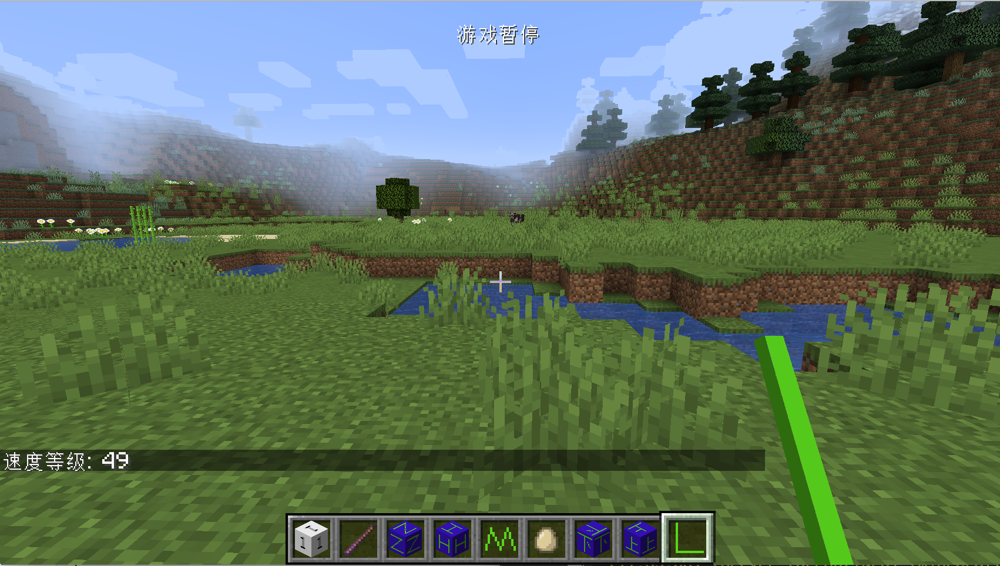

# 附加能力提供器

在之前的章节中，我们已经学习了如何使用能力系统，已经知道了如何从零创建一个能力。在这节中，我们将要来学习，如何为现有的实体、物品等附加能力提供器。

在这节中，我们会给玩家添加一个新的CapabilityProvider，让玩家可以拥有一套新的等级系统。

首先我们来创建一个能力，这个能力非常简单。

```java
public interface ISpeedUpCapability extends INBTSerializable<CompoundNBT> {
    int getLevel();
}
```

```java
public class SpeedUpCapability implements ISpeedUpCapability {
    private int level;

    public SpeedUpCapability(int level) {
        this.level = level;
    }

    @Override
    public int getLevel() {
        return level;
    }

    @Override
    public CompoundNBT serializeNBT() {
        CompoundNBT compoundNBT = new CompoundNBT();
        compoundNBT.putInt("level", this.level);
        return compoundNBT;
    }

    @Override
    public void deserializeNBT(CompoundNBT nbt) {
        this.level = nbt.getInt("level");
    }
}
```

可以看见我们让我们的Capability实现了`INBTSerializable<CompoundNBT>`接口，之所以要这么做的原因是，我们之后需要保存和恢复数据。**请注意，虽然这里的Capability实现了`INBTSerializable<CompoundNBT>`，但是实际保存数据的地方并不在Capability中，而是在CapabilityProvider中，请务必区分**

上面的内容非常好懂，就不多加说明了。

不要忘了创建与注册能力。

```java
@CapabilityInject(ISpeedUpCapability.class)
public static Capability<ISpeedUpCapability> SPEED_UP_CAPABILITY;
```

```java
@Mod.EventBusSubscriber(bus = Mod.EventBusSubscriber.Bus.MOD)
public class CommonSetupEventHandler {
    @SubscribeEvent
    public static void onSetupEvent(FMLCommonSetupEvent event) {
        event.enqueueWork(() -> {
            CapabilityManager.INSTANCE.register(
                    ISpeedUpCapability.class,
                    new Capability.IStorage<ISpeedUpCapability>() {
                        @Nullable
                        @Override
                        public INBT writeNBT(Capability<ISpeedUpCapability> capability, ISpeedUpCapability instance, Direction side) {
                            return null;
                        }

                        @Override
                        public void readNBT(Capability<ISpeedUpCapability> capability, ISpeedUpCapability instance, Direction side, INBT nbt) {

                        }
                    },
                    () -> null
            );
        });
    }
}
```

同样的，别忘了放在`event.enqueueWork`中执行。

接下来就是重头戏，我们来创建一个新的CapabilityProvider

```java
public class SpeedUpCapabilityProvider implements ICapabilityProvider, INBTSerializable<CompoundNBT> {
    private ISpeedUpCapability speedUpCapability;

    @Nonnull
    @Override
    public <T> LazyOptional<T> getCapability(@Nonnull Capability<T> cap, @Nullable Direction side) {
        return cap == ModCapability.SPEED_UP_CAPABILITY ? LazyOptional.of(this::getOrCreateCapability).cast() : LazyOptional.empty();
    }

    @Nonnull
    ISpeedUpCapability getOrCreateCapability() {
        if (speedUpCapability == null) {
            Random random = new Random();
            this.speedUpCapability = new SpeedUpCapability(random.nextInt(99) + 1);
        }
        return this.speedUpCapability;
    }

    @Override
    public CompoundNBT serializeNBT() {
        return getOrCreateCapability().serializeNBT();
    }

    @Override
    public void deserializeNBT(CompoundNBT nbt) {
        getOrCreateCapability().deserializeNBT(nbt);
    }
}
```

可以看到，这里我们实现了两个接口`ICapabilityProvider`和`INBTSerializable<CompoundNBT>`，其中`ICapabilityProvider`接口是必须实现的，而`INBTSerializable<CompoundNBT>`是可以不用实现的，如果你的CapabilityProvider不需要保存数据，你可以不实现这个接口，如果你实现了这个接口，当你附加完能力时，Forge在保存数据和读取数据时，会自动调用这两个接口。

我们在这里直接调用了，我们之前实现的Capability内相对应的方法。

`getOrCreateCapability`内容很简单，就是如果没有创建能力就创建一个新的能力，如果有就返回一个旧的能力，并且在创建新的能力时，随机给予一个等级。

接下来我们需要讲我们的能力附加到玩家身上。

```java
@Mod.EventBusSubscriber()
public class CommonEventHandler {
    @SubscribeEvent
    public static void onAttachCapabilityEvent(AttachCapabilitiesEvent<Entity> event) {
        Entity entity = event.getObject();
        if (entity instanceof PlayerEntity) {
            event.addCapability(new ResourceLocation(Utils.MOD_ID, "speedup"), new SpeedUpCapabilityProvider());
        }
    }

    @SubscribeEvent
    public static void onPlayerCloned(PlayerEvent.Clone event) {
        if (!event.isWasDeath()) {
            LazyOptional<ISpeedUpCapability> oldSpeedCap = event.getOriginal().getCapability(ModCapability.SPEED_UP_CAPABILITY);
            LazyOptional<ISpeedUpCapability> newSpeedCap = event.getPlayer().getCapability(ModCapability.SPEED_UP_CAPABILITY);
            if (oldSpeedCap.isPresent() && newSpeedCap.isPresent()) {
                newSpeedCap.ifPresent((newCap) -> {
                    oldSpeedCap.ifPresent((oldCap) -> {
                        newCap.deserializeNBT(oldCap.serializeNBT());
                    });
                });
            }
        }
    }
}
```

我们先来看`onAttachCapabilityEvent` 这个事件处理器。

```java
@SubscribeEvent
public static void onAttachCapabilityEvent(AttachCapabilitiesEvent<Entity> event) {
  Entity entity = event.getObject();
  if (entity instanceof PlayerEntity) {
    event.addCapability(new ResourceLocation(Utils.MOD_ID, "speedup"), new SpeedUpCapabilityProvider());
  }
}
```

这里我们监听了`AttachCapabilitiesEvent<Entity>`事件，我们可以通过这个事件来为特定的对象附加自定义的CapabilityProvider。这里我们就简单了判断了实体是不是玩家，如果是玩家，就附加能力。**请注意：**`event.addCapability`方法，看上去附加的好像不是CapabilityProvider而是Capability，但如果你观察过它的函数签名，你会发现第二个参数需要的类型是`ICapabilityProvider`，所以在一开始你可以把这个函数理解成成`event.addCapabilityProvider`。这里的第一个参数是一个标记符，每一个附加的CapabilityProvder都必须是唯一的，`ResourceLocation`第一个参数一般情况填入你的`modId`，后一个参数随你喜好填。

 可以填入的值有：

- Entity
- TileEntity
- ItemStack
- World
- Chunk

接下来我们来看 

```java
@SubscribeEvent
public static void onPlayerCloned(PlayerEvent.Clone event) {
  if (!event.isWasDeath()) {
    LazyOptional<ISpeedUpCapability> oldSpeedCap = event.getOriginal().getCapability(ModCapability.SPEED_UP_CAPABILITY);
    LazyOptional<ISpeedUpCapability> newSpeedCap = event.getPlayer().getCapability(ModCapability.SPEED_UP_CAPABILITY);
    if (oldSpeedCap.isPresent() && newSpeedCap.isPresent()) {
      newSpeedCap.ifPresent((newCap) -> {
        oldSpeedCap.ifPresent((oldCap) -> {
          newCap.deserializeNBT(oldCap.serializeNBT());
        });
      });
    }
  }
}
```

当玩家死亡后重生或者从末地回到主世界，都会触发这个方法，理论上来说从末地回到主世界应该会自动同步数据，不知道处于什么样子的考虑，这个功能一直没有实现，所以我们需要在这里手动的恢复我们的能力。`event.isWasDeath()` 为真时代表玩家死亡后重生，而为假时代表从末地回到主世界。在这里`event.getOriginal()` 得到的是玩家之前的实体，`event.getPlayer()`代表的是玩家重生之后的实体。

`newCap.deserializeNBT(oldCap.serializeNBT());`我们在这里恢复了数据，这就是为什么我们需要让我们的Capability也实现`INBTSerializable<CompoundNBT>`的原因。

最后就是使用能力了

```java
public class ObsidianSpeedUpShowItem extends Item {
    public ObsidianSpeedUpShowItem() {
        super(new Properties().group(ModGroup.itemGroup));
    }

    @Override
    public ActionResult<ItemStack> onItemRightClick(World worldIn, PlayerEntity playerIn, Hand handIn) {
        if (!worldIn.isRemote && handIn == Hand.MAIN_HAND) {
            LazyOptional<ISpeedUpCapability> speedCap = playerIn.getCapability(ModCapability.SPEED_UP_CAPABILITY);
            speedCap.ifPresent((l) -> {
                        int level = l.getLevel();
                        playerIn.sendMessage(new TranslationTextComponent("message.obsidian_speed_show", level), playerIn.getUniqueID());
                    }
            );
        }
        return super.onItemRightClick(worldIn, playerIn, handIn);
    }
}
```

没什么好说的，我们只是从Capability从获取了等级并且输出到了聊天框而已。



打开游戏，右键相对应的物品，你就能看到等级被显示了。

[源代码](https://github.com/FledgeXu/BosonSourceCode/tree/master/src/main/java/com/tutorial/boson/entity_capabilityprovider)

