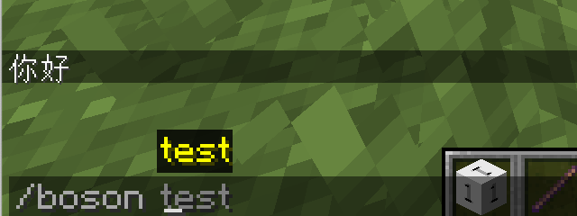

# 命令

在这节中，我们将来学习如何向Minecraft中添加一个命令。首先要明确的是命令是一个服务端只在服务端存在的东西（虽然也有客户端的命令，但是我在写这段时[还没有实现](https://github.com/MinecraftForge/MinecraftForge/pull/6670)）。

接下来开始我们的实现吧。

```
/boson test
```

这里我们以上面这条命令为例。

```java
@Mod.EventBusSubscriber
public class CommandEventHandler {
    @SubscribeEvent
    public static void onServerStaring(RegisterCommandsEvent event) {
        CommandDispatcher<CommandSource> dispatcher = event.getDispatcher();
        LiteralCommandNode<CommandSource> cmd = dispatcher.register(
                Commands.literal(Utils.MOD_ID).then(
                        Commands.literal("test")
                                .requires((commandSource) -> commandSource.hasPermissionLevel(0))
                                .executes(TestCommand.instance)
                )
        );
        dispatcher.register(Commands.literal("bs").redirect(cmd));
    }
}
```

可以看见，我们这里监听了`RegisterCommandsEvent`事件，你的命令注册将会在这里完成。

我们先不看内容，先来理解Minecraft是如何解析命令的。

在我们的例子中，Minecraft首先会根据预设试图解析有没有`boson`，如果有，接着解析在`boson`下有没有`test`命令，如果有就继续解析或者执行预设的程序，这里我们的命令只有两级，所以解析成功以后就直接运行预设的程序了。

而我们的代码也对应着这个解析过程，我们来仔细观察一下`dispatcher.register`中的代码。

```java
Commands.literal(Utils.MOD_ID).then(
  Commands.literal("test")
  .requires((commandSource) -> {
    eturn commandSource.hasPermissionLevel(0);
  })
  .executes(TestCommand.instance)
)
```


`Commands.literal`代表着这是一个命令，具体来说是个没有参数的命令，这里命令就是`boson`。如果你需要有参数的命令`Commands`下还有别的类可以使用。`then`指定了，这个命令并没有到头，如果匹配了这个命令要继续接着解析。

` Commands.literal("test”)`这里就是上一条命令子命令的开始，这里的`requires`表面的执行权限是所有玩家都可以执行的。比起上一条命令，这里没有填入`then`方法，而是用了`executes`方法，这说明着我们的命令解析结束了。匹配成功之后就要自行`TestCommand.instance`这个实例所规定的操作。具体什么内容我们之后再看。

```java
dispatcher.register(Commands.literal("bs").redirect(cmd));
```

而这条句话则是一个重定向，使得`neutrino`和`nu`等价。

```java
public class TestCommand implements Command<CommandSource> {
    public static TestCommand instance = new TestCommand();

    @Override
    public int run(CommandContext<CommandSource> context) {
        context.getSource().sendFeedback(new TranslationTextComponent("cmd." + Utils.MOD_ID + ".hello"), false);
        return 0;
    }
}
```

这就是我们具体要执行操作的类，可以看到我们继承了`Command<CommandSource>`，它有个`run`需要实现，这个`run`方法里的内容就是，当你命令匹配成功时需要执行的东西。

这里我们就简单的实现了一个向玩家聊天框发送消息的命令。

至此，我们的命令已经完成。打开游戏输入命令试试吧。



[源代码](https://github.com/FledgeXu/BosonSourceCode/tree/master/src/main/java/com/tutorial/boson/command)