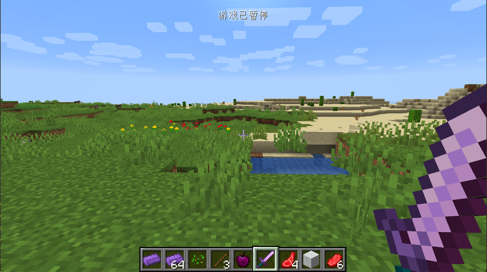

# 近战武器

在这一节中，我们将讲解如何创建一个新的剑，这里我们以黑曜石剑举例。

首先我们得创建一个`ItemTier`。`ItemTier`就是我们日常说的工具等级，比如「钻石等级」，「铁等级」以及「下届合金等级」。

```java
public enum ModItemTier implements IItemTier {

    OBSIDIAN(3, 2000, 10.0F, 4.0F, 30, () -> {
        return Ingredient.fromItems(ItemRegistry.obsidianIngot.get());
    });

    private final int harvestLevel;
    private final int maxUses;
    private final float efficiency;
    private final float attackDamage;
    private final int enchantability;
    private final LazyValue<Ingredient> repairMaterial;

     ModItemTier(int harvestLevelIn, int maxUsesIn, float efficiencyIn, float attackDamageIn, int enchantabilityIn, Supplier<Ingredient> repairMaterialIn) {
        this.harvestLevel = harvestLevelIn;
        this.maxUses = maxUsesIn;
        this.efficiency = efficiencyIn;
        this.attackDamage = attackDamageIn;
        this.enchantability = enchantabilityIn;
        this.repairMaterial = new LazyValue<>(repairMaterialIn);
    }

    @Override
    public int getMaxUses() {
        return this.maxUses;
    }

    @Override
    public float getEfficiency() {
        return this.efficiency;
    }

    @Override
    public float getAttackDamage() {
        return this.attackDamage;
    }

    @Override
    public int getHarvestLevel() {
        return this.harvestLevel;
    }

    @Override
    public int getEnchantability() {
        return this.enchantability;
    }

    @Override
    public Ingredient getRepairMaterial() {
        return this.repairMaterial.getValue();
    }

}
```


同样的，这个内容看上去非常地多，但其实并没有你想象得那么复杂。

在这里我们创建了一个`ModItemTier`类并且继承了`IItemTier`接口，这么做的原因是原版的`net.minecraft.item.ItemTier`是用enum实现的，我们没法自己向里面添加内容，所以只能自己实现了，我们在这里基本上就是复制了原版的实现，原版的所有属性也都在这个类里，大家可以参考。

至于这个enum里的各种方法，我在这里就不多加解释了，有了之前几个物品的经验，相信读者阅读到这里时已经有了通过函数名猜测函数功能的能力了。

同样的，我们先创建一个`ObsidianSword`，但是这次的继承的类有些不一样，这次我们直接继承原版的`SwordItem`类，如果你查看继承关系图，你就可以发现，`SwordItem`是`Item`的子类。


具体实现：

```java
public class ObsidianSword extends SwordItem {
    public ObsidianSword() {
        super(ModItemTier.OBSIDIAN, 3, -2.4F, new Item.Properties().group(ItemGroup.COMBAT));
    }
}
```

这里的`3`和`-2.4F`也请参考原版的实现，原版的所有物品注册都在`net.minecraft.item.Items`中。

接下去注册物品

```java
public static RegistryObject<Item> obsidianSword = ITEMS.register("obsidian_sword", ObsidianSword::new);
```

添加模型文件：

```json
{
  "parent": "item/generated",
  "textures": {
    "layer0": "boson:item/obsidian_sword"
  }
}
```

以及材质


创建完成之后打开游戏看看吧。



[源代码地址](https://github.com/FledgeXu/BosonSourceCode/tree/master/src/main/java/com/tutorial/boson/melee_weapons)

